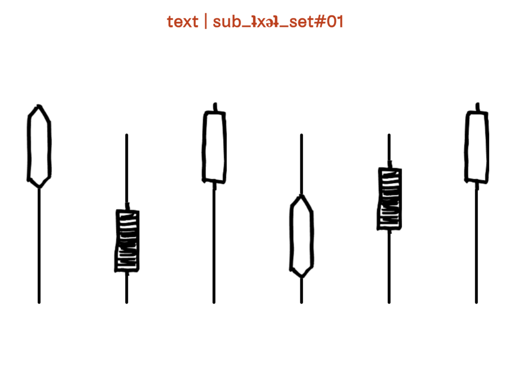

# text | sub_ʇxǝʇ

Interactive audio guide for [ZK/U – Zentrum für Kunst und Urbanistik](https://www.zku-berlin.org/timeline/text-sub-%CA%87x%C7%9D%CA%87/), Berlin.

A multi-layered sonic response to five years of making at ZK/U, by artist [Alex Head](https://soundcloud.com/alex_head) in curatorial dialogue with Lotta Schäfer, programmed by [Rafael Polo](https://extrapolo.com).

**→ [rafapolo.github.io/subzku](https://rafapolo.github.io/subzku/)**

Visitors scanned QR codes placed around the space, each opening one of six sets. Every set plays six looping tracks at once, and each hand-drawn slider mixes the volume of one layer, so every listener builds their own version of the piece.

- `set01.html` … `set06.html`: the six mixers
- `audio/setNN/t1–t6`: the tracks, in mp3, webm and ogg
- `js/player.js`: loads and loops the six layers with [howler.js](https://howlerjs.com)
- `qrcode/`: generator for the printed QR codes
